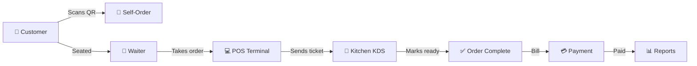

# 📚 Odoo Cafe POS — Documentation

> **Complete technical documentation** for the Odoo Cafe Point-of-Sale system — a production-inspired restaurant management platform built during a 15-hour hackathon.

---

## 📂 Documentation Index

| Document | Description |
|----------|-------------|
| [📋 Project Overview](./project-overview.md) | Problem statement, user roles, high-level app flow |
| [🛠️ Tech Stack](./tech-stack.md) | Frontend, backend, database & realtime technology breakdown |
| [🏗️ System Architecture](./system-architecture.md) | Architecture diagram, component breakdown, data flow |
| [🗄️ Database Schema](./database-schema.md) | 14 Prisma models, ERD, relationships & design decisions |
| [🔄 Project Flow](./project-flow.md) | Ordering flow + payment flow with sequence diagrams |
| [⚡ Features](./features.md) | Floor editor, POS terminal, KDS, admin panels — summaries |

---

## 🚀 Quick Navigation

```
docs/
├── README.md               ← You are here
├── project-overview.md     ← Start here for context
├── tech-stack.md           ← Technology choices
├── system-architecture.md  ← How it all fits together
├── database-schema.md      ← Data models & ERD
├── project-flow.md         ← Core user journeys
└── features.md             ← Feature-by-feature breakdown
```

---

## 🏪 What is Odoo Cafe POS?

A **full-stack Point-of-Sale system** for cafes and restaurants with:

- 🪑 **Table & Floor Management** — Visual floor plan with drag-and-drop
- 🧾 **Order Management** — Full order lifecycle from DRAFT → PAID
- 🍳 **Kitchen Display System (KDS)** — Real-time ticket updates
- 💳 **Multi-Payment Support** — Cash, Card, UPI
- 📱 **QR Self-Ordering** — Customers scan QR to order themselves
- 📊 **Admin Dashboard** — Sales reports, staff management
- 🔴 **Real-Time Updates** — Socket.IO live sync across all terminals

---

## 🎯 System at a Glance



---

*Last updated: June 2026 | Stack: React + Node.js + PostgreSQL + Socket.IO*
