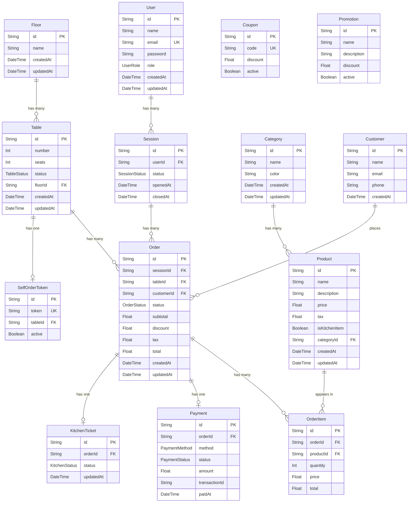
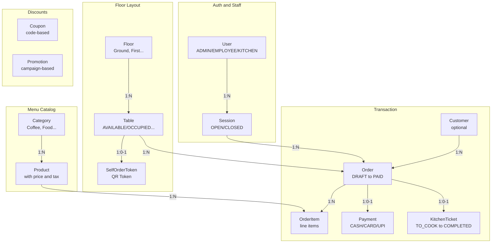
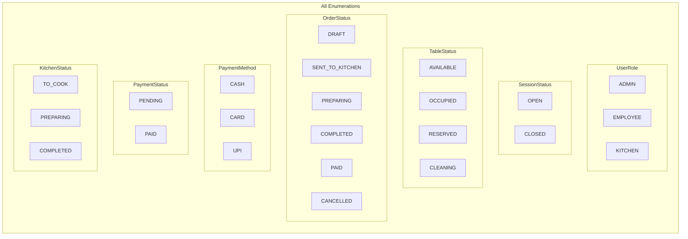
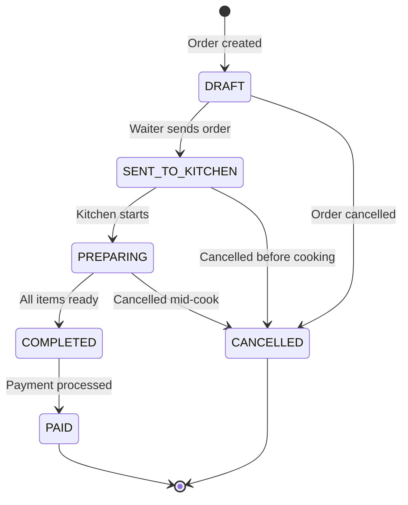
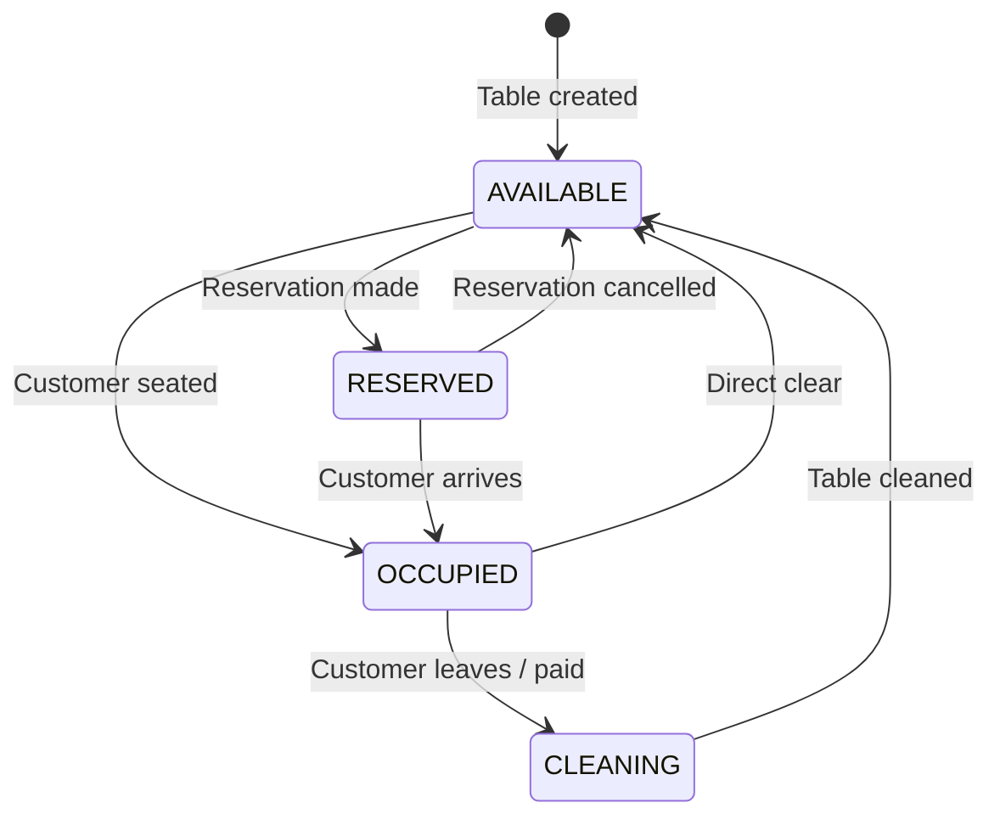
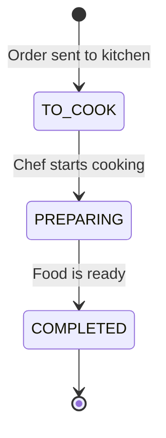

# Database Schema

> Complete data model documentation for the Odoo Cafe POS system. Built with Prisma ORM on PostgreSQL. 14 models covering the full restaurant lifecycle.

---

## Entity Relationship Diagram (Full ERD)

---

## Relationship Map

---

## Enumerations

---

## Order Lifecycle State Machine

---

## Table Lifecycle State Machine

---

## Kitchen Ticket Lifecycle

---

## Model Reference

### 1. User

| Field | Type | Constraint | Notes |
|-------|------|-----------|-------|
| `id` | String (UUID) | PK | Auto-generated |
| `name` | String | Required | Full name |
| `email` | String | Unique | Login identifier |
| `password` | String | Required | bcrypt hashed |
| `role` | UserRole | Required | ADMIN/EMPLOYEE/KITCHEN |
| `createdAt` | DateTime | Auto | Account creation |
| `updatedAt` | DateTime | Auto | Last modified |
| `sessions` | Session[] | — | Related sessions |

---

### 2. Category

| Field | Type | Constraint | Notes |
|-------|------|-----------|-------|
| `id` | String (UUID) | PK | — |
| `name` | String | Required | e.g. "Coffee", "Food" |
| `color` | String | Required | Hex color for UI |
| `products` | Product[] | — | Related products |
| `createdAt` | DateTime | Auto | — |
| `updatedAt` | DateTime | Auto | — |

---

### 3. Product

| Field | Type | Constraint | Notes |
|-------|------|-----------|-------|
| `id` | String (UUID) | PK | — |
| `name` | String | Required | Product name |
| `description` | String? | Optional | — |
| `price` | Float | Required | Selling price |
| `tax` | Float | Required | Tax percentage or amount |
| `isKitchenItem` | Boolean | Required | Send to KDS? |
| `categoryId` | String | FK to Category | — |
| `orderItems` | OrderItem[] | — | — |

---

### 4. Floor

| Field | Type | Constraint | Notes |
|-------|------|-----------|-------|
| `id` | String (UUID) | PK | — |
| `name` | String | Required | "Ground Floor", etc. |
| `tables` | Table[] | — | Related tables |

---

### 5. Table

| Field | Type | Constraint | Notes |
|-------|------|-----------|-------|
| `id` | String (UUID) | PK | — |
| `number` | Int | Required | Table number |
| `seats` | Int | Required | Seating capacity |
| `status` | TableStatus | Required | Current status |
| `floorId` | String | FK to Floor | — |
| `orders` | Order[] | — | — |
| `token` | SelfOrderToken? | — | QR token (optional) |

---

### 6. Session

| Field | Type | Constraint | Notes |
|-------|------|-----------|-------|
| `id` | String (UUID) | PK | — |
| `userId` | String | FK to User | — |
| `status` | SessionStatus | Required | OPEN or CLOSED |
| `openedAt` | DateTime | Required | Shift start |
| `closedAt` | DateTime? | Optional | Shift end |
| `orders` | Order[] | — | All orders in session |

---

### 7. Customer

| Field | Type | Constraint | Notes |
|-------|------|-----------|-------|
| `id` | String (UUID) | PK | — |
| `name` | String | Required | — |
| `email` | String? | Optional | — |
| `phone` | String? | Optional | — |
| `orders` | Order[] | — | Purchase history |

---

### 8. Order (Core model)

| Field | Type | Constraint | Notes |
|-------|------|-----------|-------|
| `id` | String (UUID) | PK | — |
| `sessionId` | String | FK to Session | Audit trail |
| `tableId` | String | FK to Table | — |
| `customerId` | String? | FK to Customer | Optional |
| `status` | OrderStatus | Required | State machine |
| `subtotal` | Float | Required | Pre-tax/discount |
| `discount` | Float | Required | Applied discount |
| `tax` | Float | Required | Calculated tax |
| `total` | Float | Required | Final amount |
| `items` | OrderItem[] | — | Line items |
| `payment` | Payment? | — | Payment record |
| `kitchenTicket` | KitchenTicket? | — | KDS ticket |

---

### 9. OrderItem

| Field | Type | Constraint | Notes |
|-------|------|-----------|-------|
| `id` | String (UUID) | PK | — |
| `orderId` | String | FK to Order | — |
| `productId` | String | FK to Product | — |
| `quantity` | Int | Required | Number ordered |
| `price` | Float | Required | Price at time of order |
| `total` | Float | Required | quantity times price |

---

### 10. Payment

| Field | Type | Constraint | Notes |
|-------|------|-----------|-------|
| `id` | String (UUID) | PK | — |
| `orderId` | String | FK to Order, Unique | 1-to-1 |
| `method` | PaymentMethod | Required | CASH/CARD/UPI |
| `status` | PaymentStatus | Required | PENDING/PAID |
| `amount` | Float | Required | Total paid |
| `transactionId` | String? | Optional | Card/UPI reference |
| `paidAt` | DateTime? | Optional | Payment timestamp |

---

### 11. KitchenTicket

| Field | Type | Constraint | Notes |
|-------|------|-----------|-------|
| `id` | String (UUID) | PK | — |
| `orderId` | String | FK to Order, Unique | 1-to-1 |
| `status` | KitchenStatus | Required | TO_COOK/PREPARING/COMPLETED |
| `updatedAt` | DateTime | Auto | Last status change |

---

### 12. SelfOrderToken

| Field | Type | Constraint | Notes |
|-------|------|-----------|-------|
| `id` | String (UUID) | PK | — |
| `token` | String | Unique | QR token value |
| `tableId` | String | FK to Table, Unique | 1-to-1 per table |
| `active` | Boolean | Required | Is QR valid |

---

### 13. Coupon

| Field | Type | Constraint | Notes |
|-------|------|-----------|-------|
| `id` | String (UUID) | PK | — |
| `code` | String | Unique | e.g. "SAVE20" |
| `discount` | Float | Required | Percentage or fixed amount |
| `active` | Boolean | Required | Is it valid |

---

### 14. Promotion

| Field | Type | Constraint | Notes |
|-------|------|-----------|-------|
| `id` | String (UUID) | PK | — |
| `name` | String | Required | Campaign name |
| `description` | String? | Optional | — |
| `discount` | Float | Required | Percentage or fixed amount |
| `active` | Boolean | Required | Is running |

---

## Key Design Decisions

```mermaid
graph TD
    D1["UUID Primary Keys<br/>Better for distributed systems<br/>No sequential ID exposure"]
    D2["Session Model<br/>Tracks shift start/end<br/>Enables per-shift reconciliation"]
    D3["Order to Session, not User<br/>Audit trail: who took order, when<br/>No direct User to Order coupling"]
    D4["KitchenTicket Separate<br/>Decouples order management from kitchen workflow<br/>KDS-specific state machine"]
    D5["SelfOrderToken 1:1 per Table<br/>One active QR per table at a time<br/>Regeneration invalidates old token"]
    D6["Coupon vs Promotion<br/>Coupon = user enters code<br/>Promotion = auto-applied"]
    D7["Customer Optional<br/>Walk-in orders do not need a customer<br/>Only used for loyalty/delivery"]
    D8["Price snapshot in OrderItem<br/>Protects against retroactive price changes<br/>Historical accuracy"]
```

---

## Relationships Summary Table

| From | To | Cardinality | Foreign Key | Notes |
|------|----|------------|-------------|-------|
| User | Session | 1 : N | `session.userId` | One user, many shifts |
| Session | Order | 1 : N | `order.sessionId` | One session, many orders |
| Floor | Table | 1 : N | `table.floorId` | One floor, many tables |
| Table | Order | 1 : N | `order.tableId` | One table, many orders (over time) |
| Table | SelfOrderToken | 1 : 0-1 | `token.tableId` (unique) | Optional QR per table |
| Category | Product | 1 : N | `product.categoryId` | One category, many products |
| Product | OrderItem | 1 : N | `orderItem.productId` | Product in many orders |
| Order | OrderItem | 1 : N | `orderItem.orderId` | One order, many line items |
| Order | Payment | 1 : 0-1 | `payment.orderId` (unique) | Optional payment record |
| Order | KitchenTicket | 1 : 0-1 | `ticket.orderId` (unique) | Optional kitchen ticket |
| Customer | Order | 1 : N | `order.customerId` | Optional customer per order |

---

*Previous: [System Architecture](./system-architecture.md) | Next: [Project Flow](./project-flow.md)*