# Features

> Detailed breakdown of all major features in the Odoo Cafe POS system — what each does, who uses it, and how it works technically.

---

## Feature Map

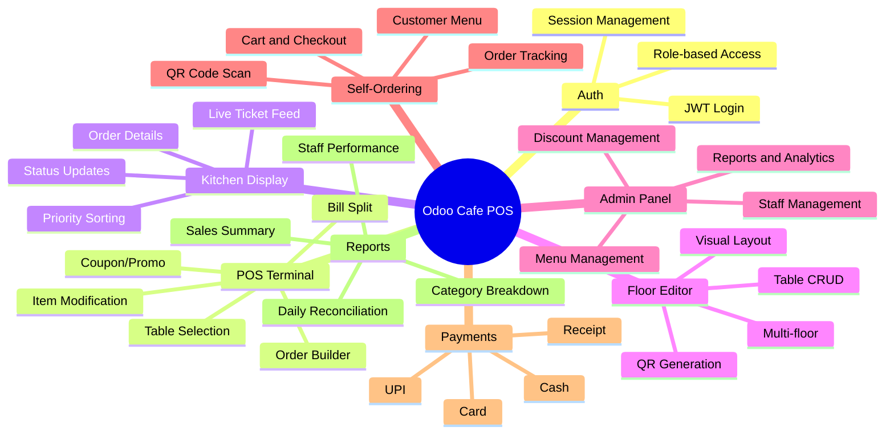

---

## 1. Authentication and Authorization

### Overview

Secure JWT-based authentication with role-based access control for all system users.

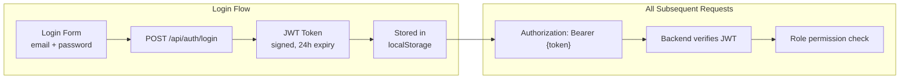

### Features

| Feature | Description |
|---------|-------------|
| JWT Authentication | Stateless tokens, 24-hour expiry |
| Role Guard | Middleware enforces role permissions per route |
| Auto Redirect | 401 responses redirect to login |
| Token Injection | Axios interceptor adds JWT to every request |
| Password Hashing | bcrypt with salt rounds for secure storage |
| Protected Routes | React Router guards for client-side protection |

### Who Can Access What

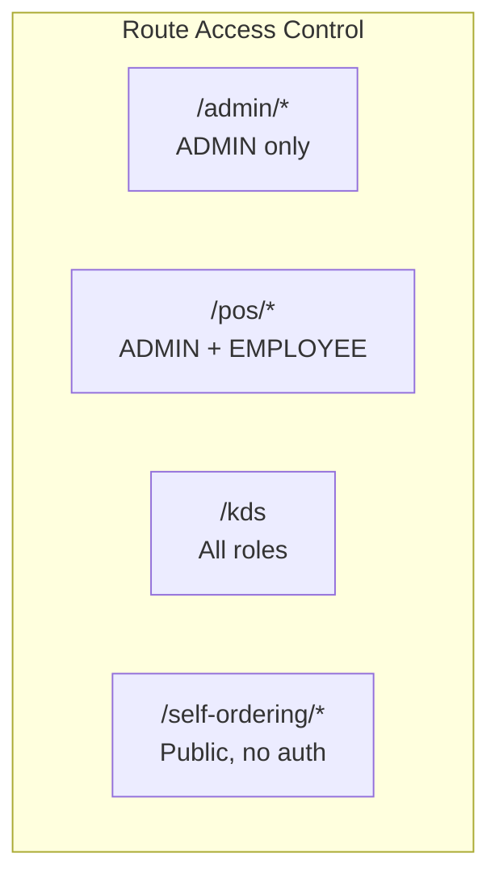

---

## 2. POS Terminal

### Overview

The primary interface for waitstaff — a full-featured point-of-sale terminal for managing tables, taking orders, and processing payments.

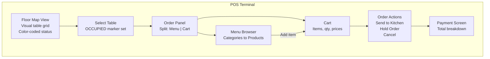

### Key Features

| Feature | Detail |
|---------|--------|
| Table Floor View | Color-coded tables by status (green=free, red=occupied, yellow=reserved) |
| Dual-pane UI | Left: menu browse, Right: current order cart |
| Category Filter | Filter menu by category (Coffee, Food, Drinks, etc.) |
| Quick Add | One-click add items to order |
| Quantity Adjust | + / - buttons for item quantities |
| Order Notes | Add special instructions per item |
| Coupon Code | Enter coupon code for discount |
| Live Totals | Subtotal, tax, discount, final total auto-calculate |
| Send to Kitchen | One-click send — updates order + creates KDS ticket |
| Hold Order | Save draft, attend to another table |
| Split Bill | Divide payment among multiple customers |
| Receipt Print | Generate printable receipt |

---

## 3. Kitchen Display System (KDS)

### Overview

A dedicated screen for kitchen staff showing all incoming orders in real-time with the ability to update preparation status.

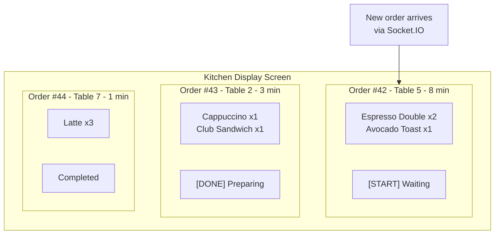

### Real-Time Update Flow

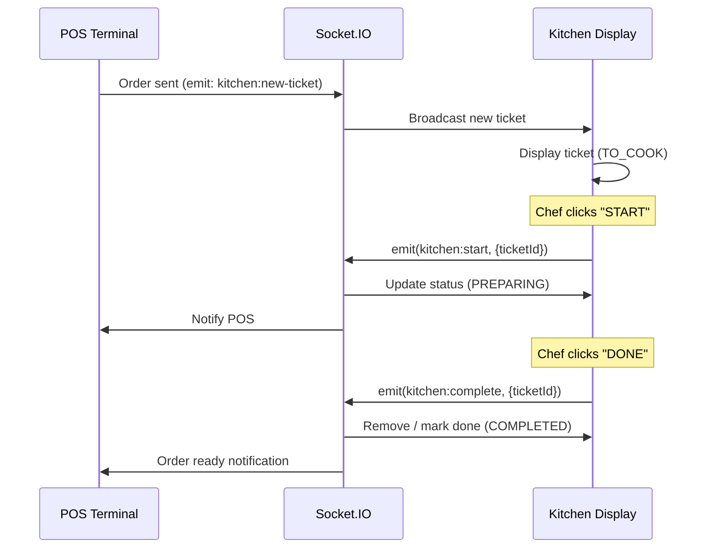

### Features

| Feature | Detail |
|---------|--------|
| Live Ticket Feed | Real-time via Socket.IO — no refresh needed |
| Status Buttons | START to PREPARING, DONE to COMPLETED |
| Ticket Timer | Shows how long each ticket has been waiting |
| Item Count | Clear quantity display per item |
| Priority Sorting | Oldest tickets appear first |
| Audio Alert | Sound notification for new tickets |
| Completed Archive | Recent completed orders viewable briefly |
| Kitchen-Only Items | Only products with `isKitchenItem: true` shown |

---

## 4. Floor Editor (Admin)

### Overview

An admin tool for configuring the physical restaurant layout — floors, tables, and QR code generation.

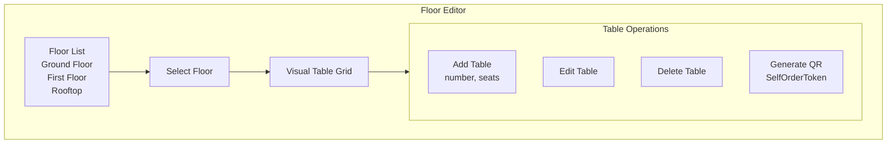

### Features

| Feature | Detail |
|---------|--------|
| Multi-Floor Support | Unlimited floors (Ground, First, Rooftop, etc.) |
| Table CRUD | Add/edit/delete tables with number and seat count |
| Visual Grid | See all tables at a glance |
| Table Status View | Real-time color-coded status (live data) |
| QR Generation | Generate per-table QR codes for self-ordering |
| QR Invalidation | Regenerating a QR invalidates the old one |
| Seat Capacity | Set number of seats per table |

---

## 5. Self-Ordering Portal

### Overview

A customer-facing web page (no app install required) accessed by scanning the table QR code. Customers can browse the menu and place orders directly.

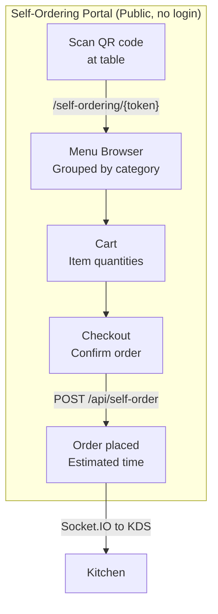

### Features

| Feature | Detail |
|---------|--------|
| No Login Required | Customers access via QR only |
| Token Validation | Each QR token tied to a specific table |
| Full Menu Browse | Categories, products, descriptions, prices |
| Cart Management | Add/remove items, adjust quantities |
| Real-Time Confirmation | Instant order confirmation screen |
| Kitchen Integration | Order goes directly to KDS via Socket.IO |
| Mobile Optimized | Responsive design for smartphones |

---

## 6. Admin Dashboard

### Overview

Central management hub for administrators to control every aspect of the system.

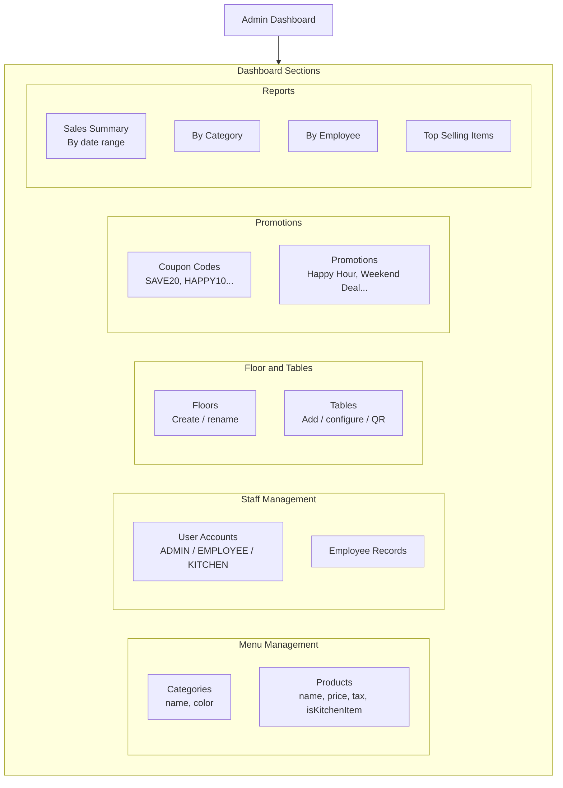

### Features

| Module | Features |
|--------|---------|
| Menu Management | CRUD for categories (with color), products (price, tax, kitchen flag) |
| Staff Management | Create/edit/deactivate staff accounts, assign roles |
| Floor Management | Multi-floor layout, table configuration |
| Coupon Management | Create/activate/deactivate coupon codes with discount amounts |
| Promotion Management | Campaign-based auto-applied discounts |
| Sales Reports | Revenue by date, category, employee, time-of-day |
| Session Review | Review all sessions by staff member |

---

## 7. Payment Processing

### Overview

Multi-method payment processing with full audit trail and receipt generation.

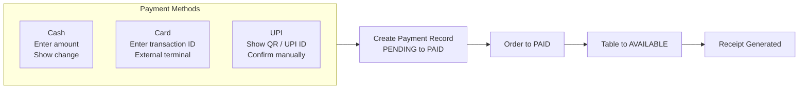

### Features

| Feature | Detail |
|---------|--------|
| Cash | Enter received amount, calculate and display change |
| Card | Record transaction ID from external card terminal |
| UPI | Display UPI QR/ID, manual confirmation |
| Discount Application | Coupon/promotion applied before total |
| Tax Calculation | Per-product tax rates computed automatically |
| Receipt | Itemized receipt with taxes, discounts, totals |
| Payment History | All payments stored with method, amount, timestamp |
| Refund Note | Manual refund process via admin |

---

## 8. Reports and Analytics

### Overview

Business intelligence for administrators — track revenue, popular items, and staff performance.

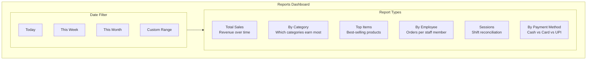

### Key Metrics

| Metric | Description |
|--------|-------------|
| Total Revenue | Sum of all paid orders in period |
| Order Count | Number of completed orders |
| Average Order Value | Revenue divided by order count |
| Top Products | Ranked by quantity sold |
| Category Breakdown | Revenue percentage by menu category |
| Staff Performance | Orders taken per employee per session |
| Peak Hours | Orders by hour of day |
| Payment Mix | Cash / Card / UPI ratio |

---

## 9. Real-Time Notifications

### Overview

Socket.IO-powered live updates that keep all terminals synchronized without page refreshes.

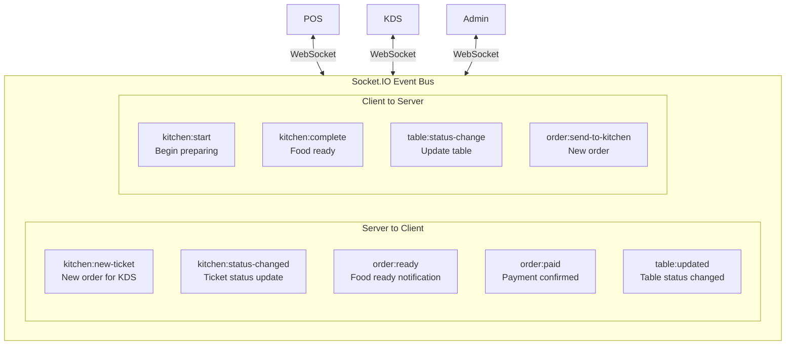

---

## Feature Implementation Status

| Feature | Backend | Frontend | Real-Time | Status |
|---------|:-------:|:--------:|:---------:|--------|
| Auth (Login/JWT) | Done | Done | — | Ready |
| POS Terminal | Done | Done | Done | Ready |
| Kitchen Display | Done | Done | Done | Ready |
| Floor Editor | Done | Done | — | Ready |
| Self-Ordering | Done | Done | Done | Ready |
| Admin Dashboard | Done | Done | — | Ready |
| Payment Processing | Done | Done | Done | Ready |
| Reports | Done | Done | — | Ready |
| Coupon/Promo | Done | Done | — | Ready |
| Customer Display | Done | Done | Done | In Progress |
| Deployment Config | — | — | — | Pending |

---

*Previous: [Project Flow](./project-flow.md) | Back to: [README](./README.md)*
