# Project Flow

> Complete walkthrough of the core operational flows in the Odoo Cafe POS system — from ordering to payment, with real-time sync.

---

## Table of Contents

1. [Ordering Flow](#1-ordering-flow)
2. [Payment Flow](#2-payment-flow)
3. [Kitchen (KDS) Flow](#3-kitchen-kds-flow)
4. [Self-Ordering Flow](#4-self-ordering-qr-flow)
5. [Staff Session Flow](#5-staff-session-flow)
6. [Admin Flow](#6-admin-management-flow)

---

## 1. Ordering Flow

### Overview

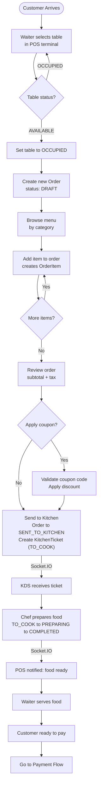

### Detailed Order Creation Sequence

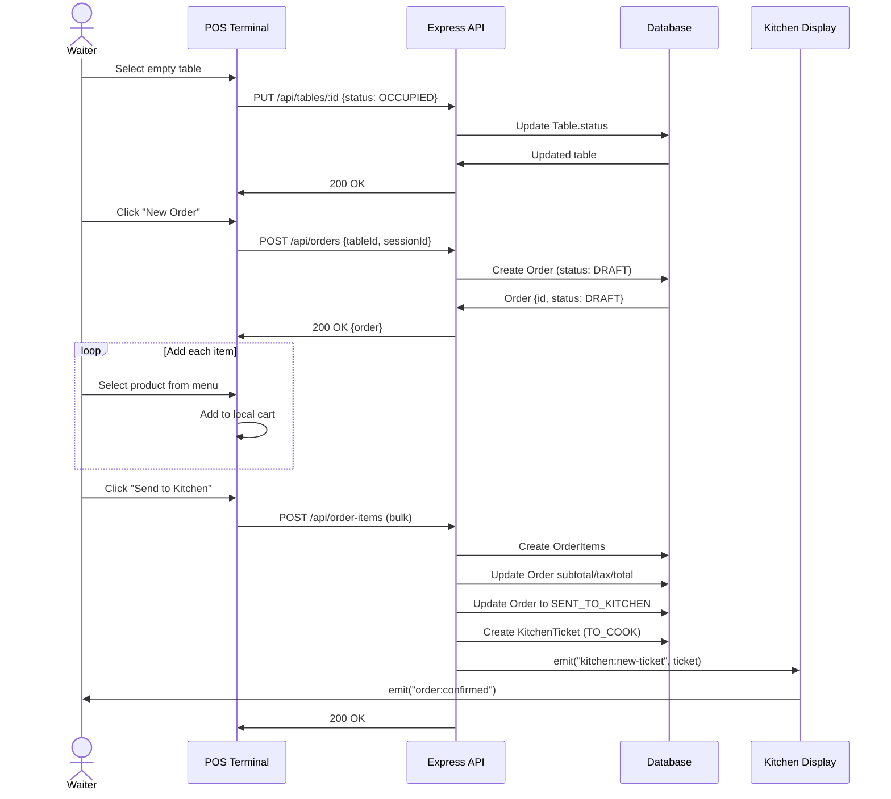

---

## 2. Payment Flow

### Overview

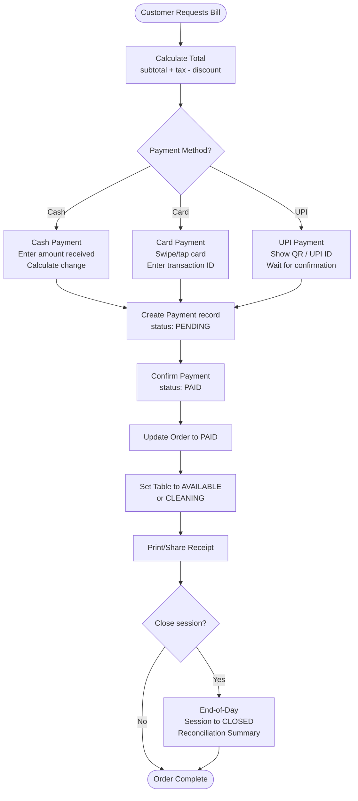

### Payment Sequence Diagram

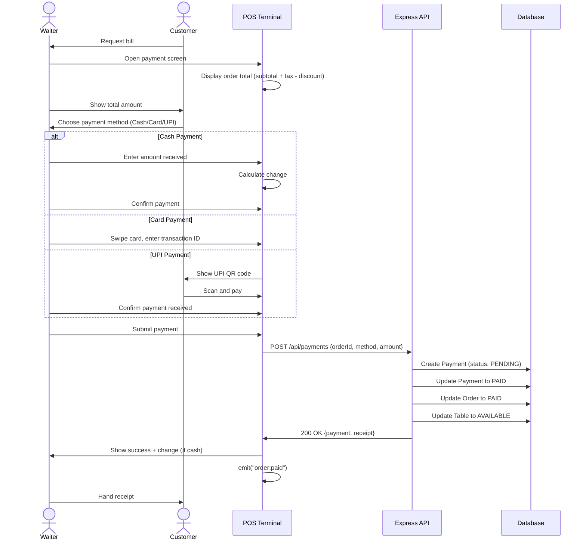

---

## 3. Kitchen (KDS) Flow

### Kitchen Display System Lifecycle

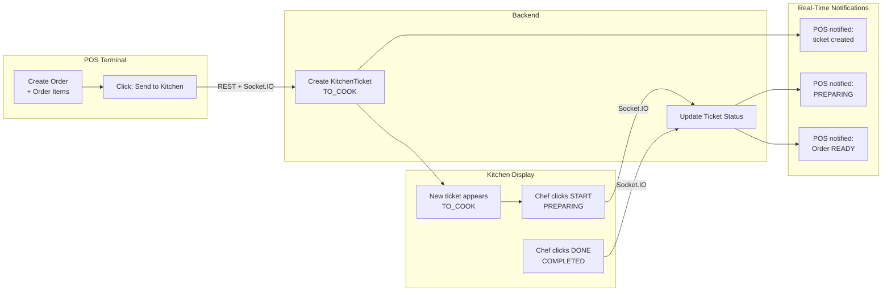

### KDS Ticket Priority and Display

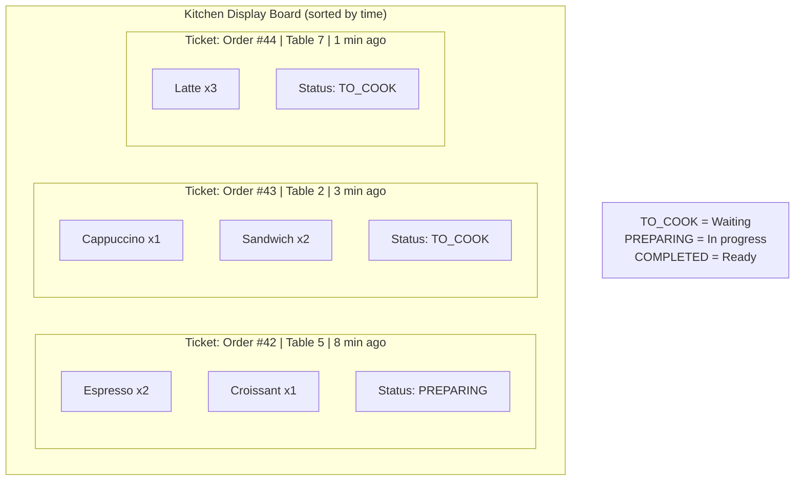

---

## 4. Self-Ordering (QR) Flow

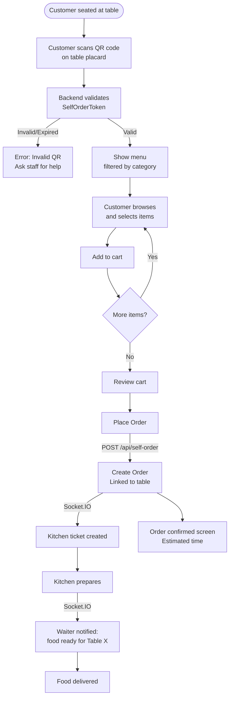

### QR Token Generation

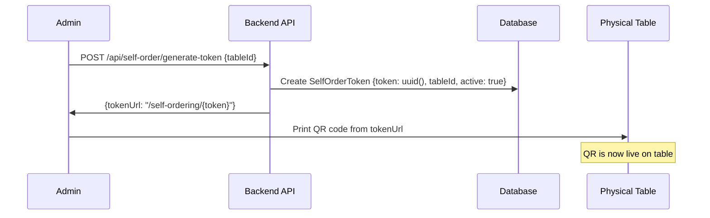

---

## 5. Staff Session Flow

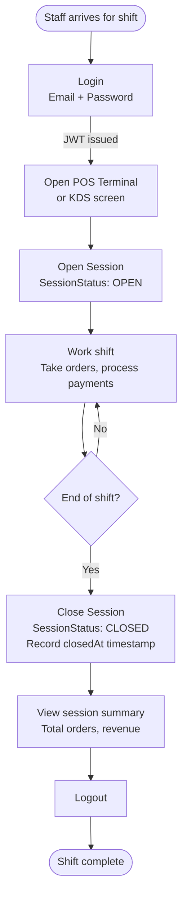

### Session-Based Audit Trail

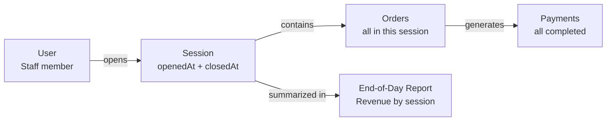

---

## 6. Admin Management Flow

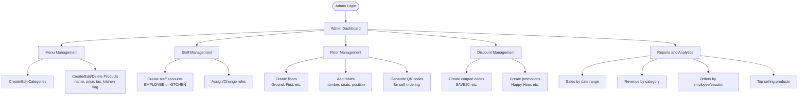

---

## Complete System Flow Summary

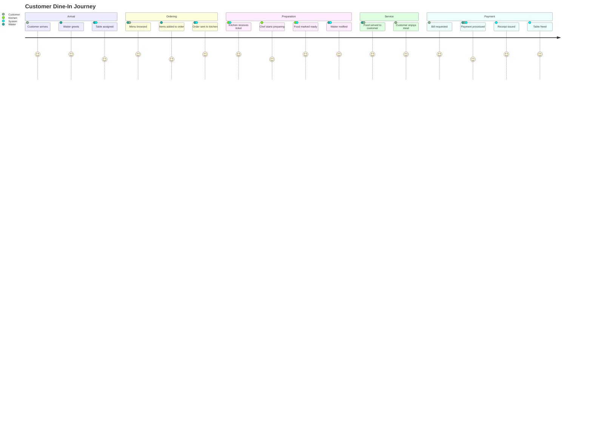

---

## Real-Time Events Summary

| Trigger | Event Emitted | Receivers | Purpose |
|---------|--------------|-----------|---------|
| Order sent to kitchen | `kitchen:new-ticket` | All KDS screens | Show new ticket |
| Chef starts cooking | `kitchen:status-changed` | POS terminals | Update order status |
| Food ready | `order:ready` | POS terminals + customer display | Notify waiter |
| Payment confirmed | `order:paid` | All connected clients | Update displays |
| Table status changed | `table:updated` | All POS terminals | Update floor map |
| New self-order | `kitchen:new-ticket` | KDS screens | Self-order to kitchen |

---

*Previous: [Database Schema](./database-schema.md) | Next: [Features](./features.md)*
