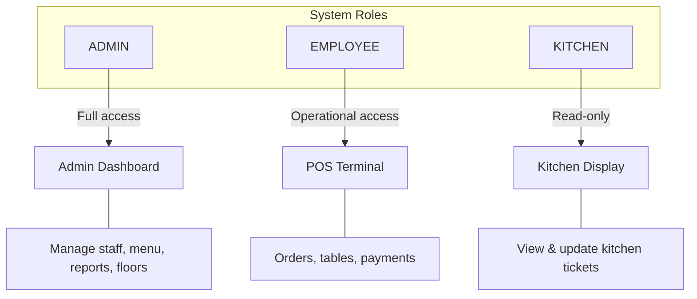
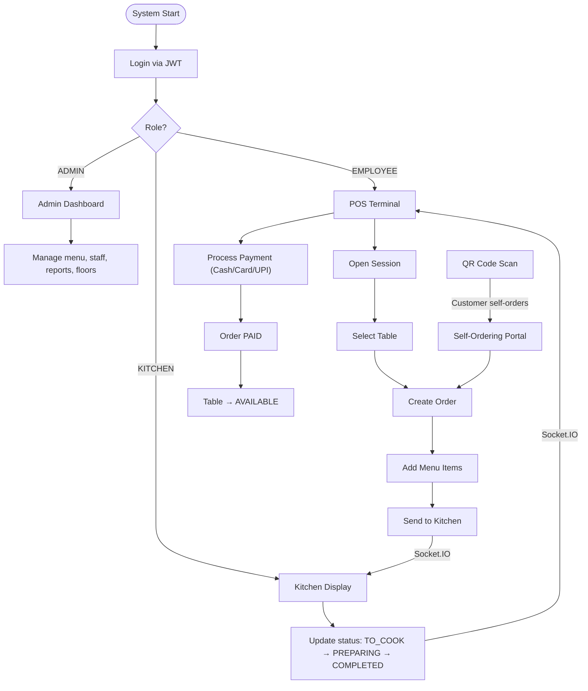
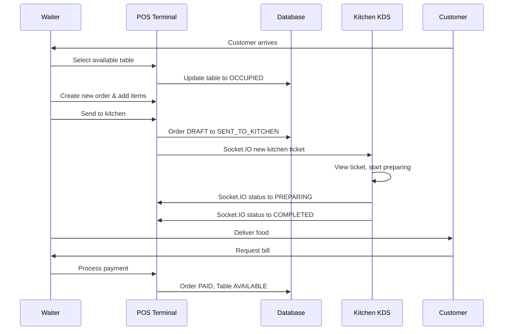
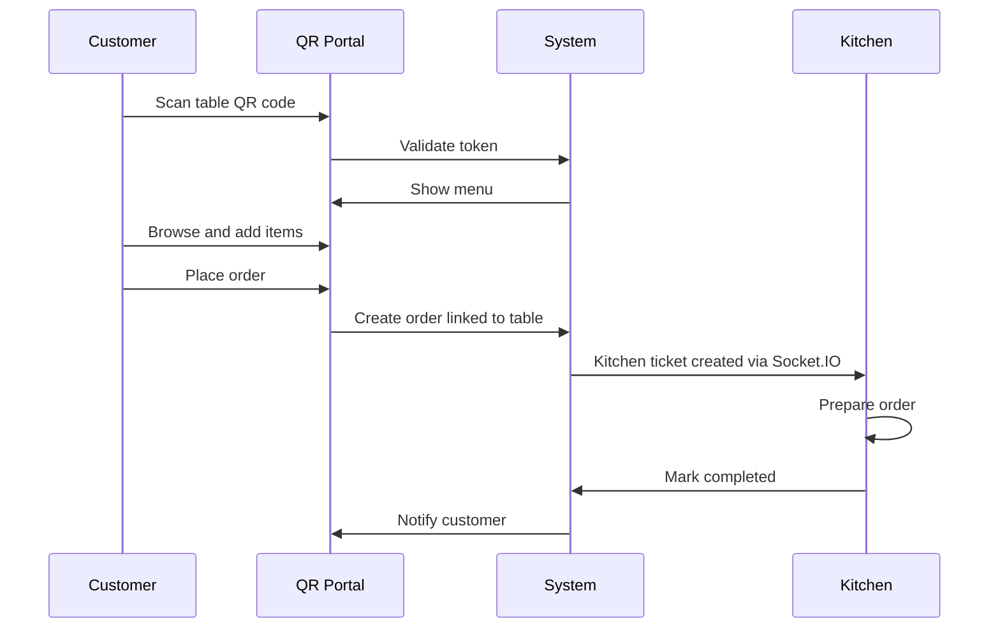
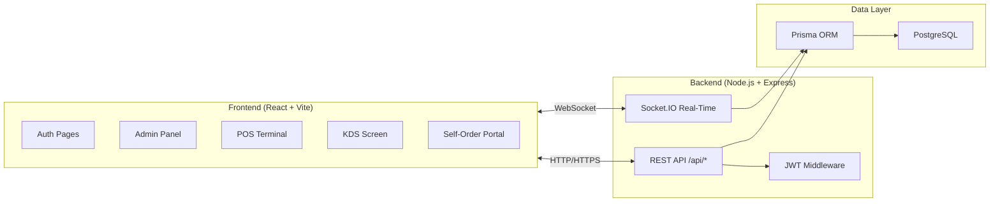

# Project Overview

> Odoo Cafe POS — A production-grade Point-of-Sale system built for cafes and restaurants, developed during a 15-hour hackathon.

---

## Problem Statement

Modern cafes struggle with:

| Problem | Impact |
|---------|--------|
| Paper-based or fragmented ordering | Orders get lost, slow service |
| No real-time kitchen visibility | Delays, wrong orders, food waste |
| Manual table tracking | Confused staff, poor customer experience |
| Cash-only or single payment method | Revenue loss |
| No analytics or reporting | Cannot identify peak hours or top sellers |
| No self-service option | Bottleneck during rush hours |

Odoo Cafe POS solves all of these with a unified, real-time system.

---

## Solution

A web-based POS platform that connects:

- Front-of-house (waiters, cashiers) via a browser-based POS terminal
- Kitchen staff via a real-time Kitchen Display System (KDS)
- Customers via QR-based self-ordering
- Management via an admin dashboard with analytics

---

## User Roles

### Role Permissions Matrix

| Feature | ADMIN | EMPLOYEE | KITCHEN |
|---------|:-----:|:--------:|:-------:|
| View Dashboard | Yes | No | No |
| Manage Users/Staff | Yes | No | No |
| Manage Products/Menu | Yes | No | No |
| Edit Floor Layout | Yes | No | No |
| View Sales Reports | Yes | No | No |
| Manage Coupons/Promos | Yes | No | No |
| Take Orders (POS) | Yes | Yes | No |
| Process Payments | Yes | Yes | No |
| Manage Tables | Yes | Yes | No |
| View Kitchen Tickets | Yes | Yes | Yes |
| Update Ticket Status | No | No | Yes |

---

## High-Level App Flow

---

## User Journeys

### Journey 1: Dine-In (Waiter)

### Journey 2: Self-Ordering (QR)

---

## System Components Summary

---

## Key Metrics (Target)

| Metric | Target |
|--------|--------|
| Order creation time | Under 30 seconds |
| Kitchen notification latency | Under 500ms (Socket.IO) |
| Concurrent tables supported | 50+ |
| Payment methods | 3 (Cash, Card, UPI) |
| Self-ordering via QR | Per-table tokens |
| API response time | Under 200ms (p95) |

---

*Previous: [Back to README](./README.md) | Next: [Tech Stack](./tech-stack.md)*