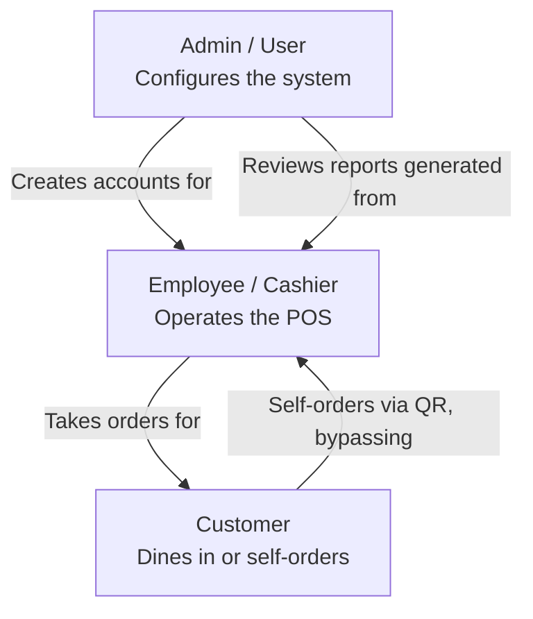

# Roles

> The three roles in the Odoo Cafe POS system, what each one can do, and how they relate to one another.

---

## Role Overview

---

## 1. Admin (User)

The Admin is the person who logs into the backend to configure and manage everything before and after POS sessions.

### Responsibilities

- Sign up and log in to the system
- Manage Products and Categories
- Configure Payment Methods (Cash, Digital/Card, UPI QR)
- Create and manage Floors and Tables
- Set up Coupons and Promotions
- Manage User and Employee accounts (create, change password, archive, delete)
- Configure Self-Ordering (mode, background, QR codes)
- Review Reports and the Sales Dashboard

### Access

| Area | Access |
|------|--------|
| Backend (admin panels) | Full access |
| POS Terminal | Full access |
| Reports & Dashboard | Full access |
| Kitchen Display | View access |

---

## 2. Employee (Cashier)

The Employee operates the POS terminal to take orders, manage tables, and handle payments during a shift.

### Responsibilities

- Open and close POS sessions
- Select tables from the Floor pop-up and take orders
- Add products to the cart, adjust quantities, apply coupons or discounts
- Send orders to the Kitchen Display
- Manage customers (create, edit, link to an order)
- Process payments (Cash, Card/Digital, UPI QR)
- Print or email receipts
- View and edit Orders for the current session

### Access

| Area | Access |
|------|--------|
| Backend (admin panels) | No access |
| POS Terminal | Full access |
| Reports & Dashboard | No access |
| Kitchen Display | View access (as kitchen staff, if same account is used) |

---

## 3. Customer

The Customer is a person who visits the cafe. They are either managed entirely by the Employee within the POS terminal, or they interact directly with the system through Self-Ordering.

### Responsibilities (Self-Ordering only)

- Scan the table's QR code to open the self-order portal
- Browse the digital menu (QR Menu mode) or place an order (Online Ordering mode)
- Add items to cart and apply coupon codes
- Track order status (To Cook, Preparing, Completed)

### Access

| Area | Access |
|------|--------|
| Backend | No access |
| POS Terminal | No access |
| Self-Order Portal (`/s/<token>`) | Browse / order, depending on mode |
| Customer Facing Display | View only (order and payment status) |

---

## Role Comparison

| Capability | Admin | Employee | Customer |
|------------|:-----:|:--------:|:--------:|
| Configure products, categories, payment methods | Yes | No | No |
| Manage floors and tables | Yes | No | No |
| Create coupons and promotions | Yes | No | No |
| Manage user/employee accounts | Yes | No | No |
| Open/close POS session | No | Yes | No |
| Take orders, manage cart | No | Yes | No (unless self-ordering) |
| Process payments | No | Yes | No |
| View reports and dashboard | Yes | No | No |
| Place self-order via QR | No | No | Yes |
| View order/payment status | Yes | Yes | Yes (own order only) |

---

*Previous: [Project Overview](./project-overview.md) | Next: [Tech Stack](./tech-stack.md)*