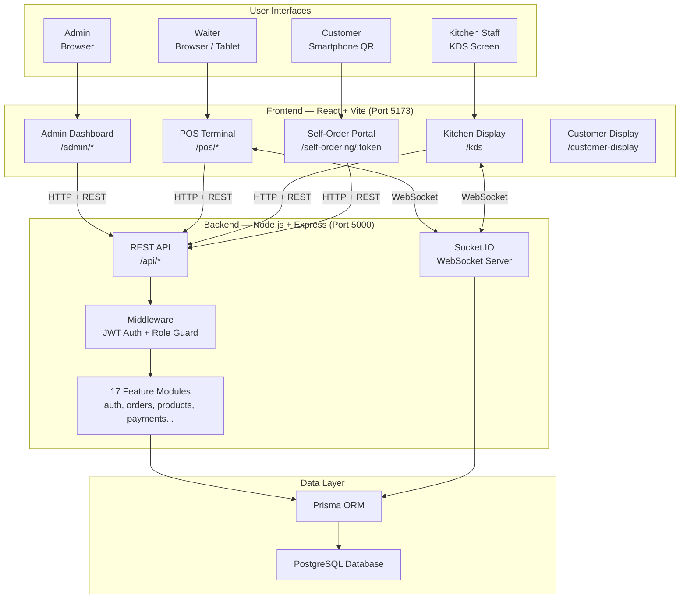
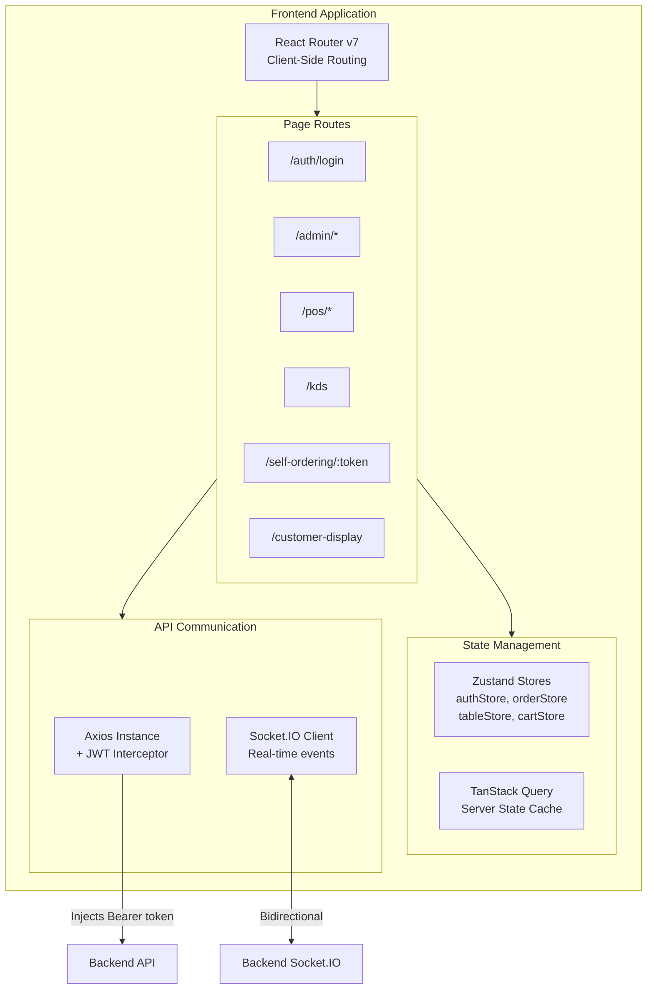
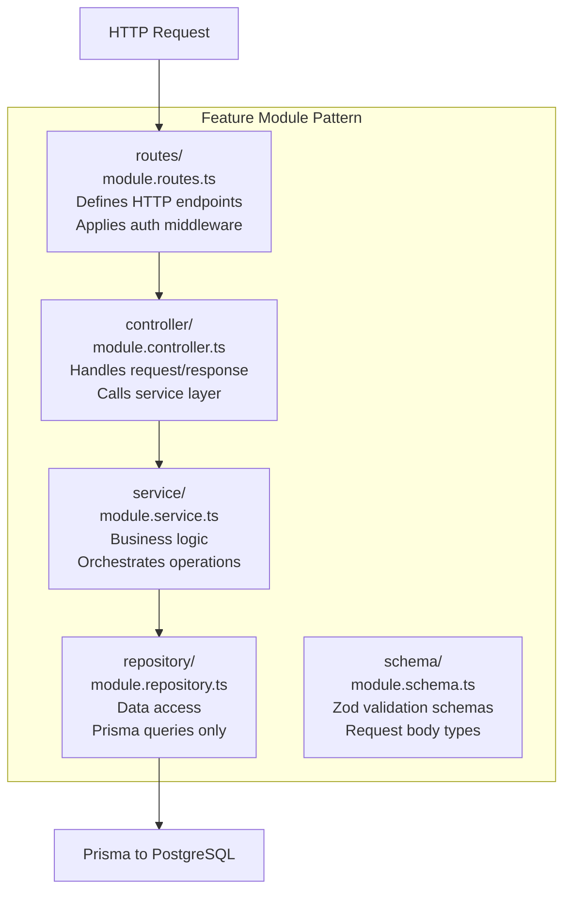
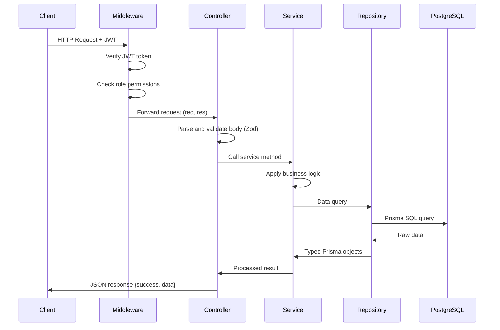
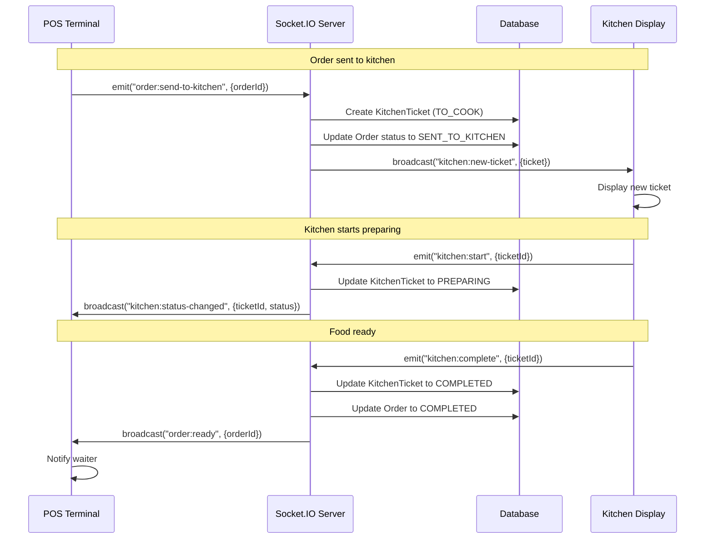
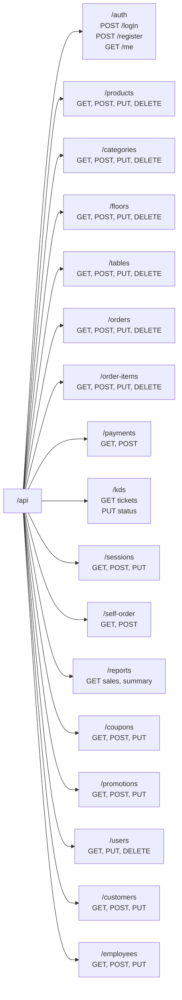
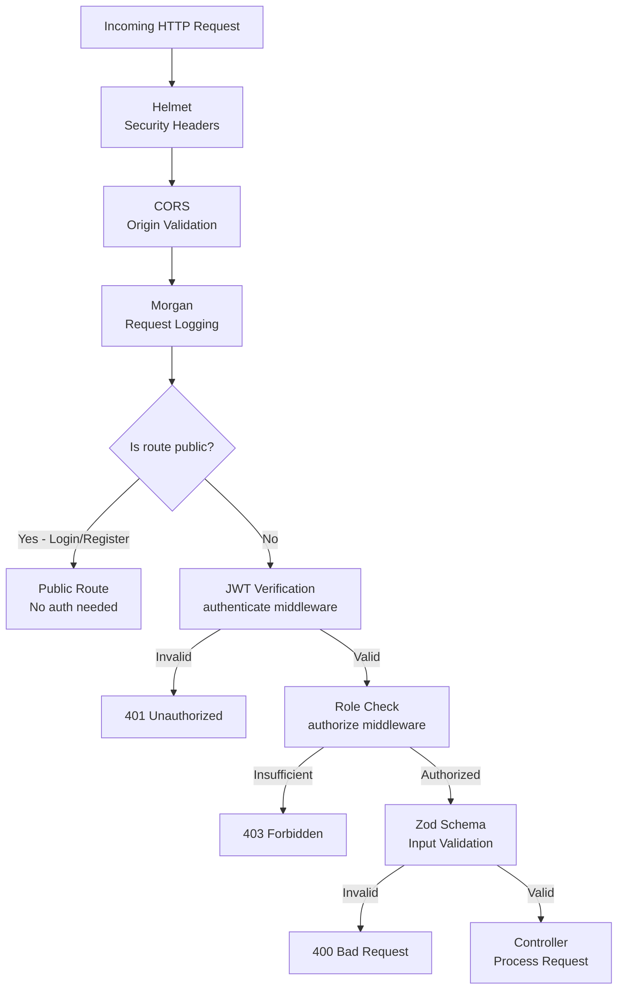
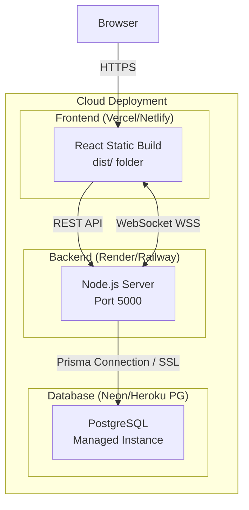

# System Architecture

> A complete architectural overview of the Odoo Cafe POS system — how all components connect and communicate.

---

## High-Level Architecture



---

## Component Breakdown

### Frontend Components



### Backend Module Structure



---

## Data Flow Diagrams

### REST API Request Flow



### Real-Time Event Flow



---

## Complete Project Structure

```
Odoo-Hack/
├── backend/
│   ├── src/
│   │   ├── app.ts                    # Express app + all routes
│   │   ├── server.ts                 # HTTP server + Socket.IO init
│   │   ├── modules/                  # Feature modules (17 total)
│   │   │   ├── auth/                 # Login, register, JWT
│   │   │   ├── users/                # User CRUD
│   │   │   ├── employees/            # Employee management
│   │   │   ├── products/             # Menu items
│   │   │   ├── categories/           # Product categories
│   │   │   ├── floors/               # Floor layout
│   │   │   ├── tables/               # Table management
│   │   │   ├── customers/            # Customer records
│   │   │   ├── sessions/             # Staff sessions
│   │   │   ├── orders/               # Order management
│   │   │   ├── orderItems/           # Order line items
│   │   │   ├── payments/             # Payment processing
│   │   │   ├── kds/                  # Kitchen Display
│   │   │   ├── coupons/              # Discount codes
│   │   │   ├── promotions/           # Campaigns
│   │   │   ├── selfOrder/            # QR self-ordering
│   │   │   └── reports/              # Analytics
│   │   ├── database/
│   │   │   └── prisma/
│   │   │       └── schema.prisma     # 14 Prisma models
│   │   └── shared/
│   │       ├── enums/                # Shared enumerations
│   │       ├── interfaces/           # Shared TypeScript types
│   │       └── validators/           # Shared Zod schemas
│   ├── package.json
│   └── tsconfig.json
│
├── frontend/
│   ├── src/
│   │   ├── App.tsx                   # Root + Router setup
│   │   ├── main.tsx                  # Entry point
│   │   ├── pages/
│   │   │   ├── auth/                 # Login page
│   │   │   ├── admin/                # Admin dashboard
│   │   │   ├── pos/                  # POS terminal
│   │   │   ├── kds/                  # Kitchen display
│   │   │   ├── self-ordering/        # QR portal
│   │   │   └── customer-display/     # Customer screen
│   │   ├── components/               # Reusable UI
│   │   ├── hooks/                    # Custom React hooks
│   │   ├── store/                    # Zustand stores
│   │   ├── services/                 # API service functions
│   │   ├── types/                    # TypeScript types
│   │   ├── lib/                      # Utilities
│   │   ├── routes/                   # Route definitions
│   │   ├── layouts/                  # Layout components
│   │   └── constants/                # App constants
│   ├── vite.config.ts
│   └── package.json
│
└── docs/
    ├── README.md
    ├── project-overview.md
    ├── tech-stack.md
    ├── system-architecture.md        <- You are here
    ├── database-schema.md
    ├── project-flow.md
    └── features.md
```

---

## API Architecture

### Route Namespacing

All API routes are mounted under `/api`:



---

## Security Architecture



---

## Deployment Architecture



---

*Previous: [Tech Stack](./tech-stack.md) | Next: [Database Schema](./database-schema.md)*